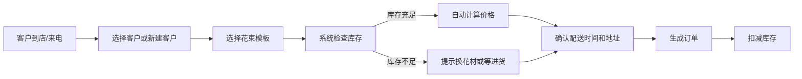

## 1. 产品概述

花小艺 - 小型花卉店订单管理系统，帮助花店老板高效管理花束定制、库存、配送订单和客户关系。通过系统化管理提升运营效率，降低人工记账错误率。

- 解决问题：手工记账混乱、库存管理不清、配送提醒遗漏、客户喜好难记录
- 目标用户：小型花卉店店主/店员（单角色使用）
- 产品价值：一站式管花、管单、管客户，让花店经营更轻松

## 2. 核心功能

### 2.1 用户角色
| 角色 | 登录方式 | 核心权限 |
|------|----------|----------|
| 店主/店员 | 无需登录（本地工具） | 全部功能 |

### 2.2 功能模块
1. **首页仪表盘**：今日待配送订单概览、库存预警提示、本月销售概览
2. **花束模板管理**：玫瑰/百合/混搭三大系列模板，含花材配方和自动定价
3. **订单管理**：新建订单、订单列表、配送状态更新、备注记录
4. **库存管理**：花材库存查询、库存预警、进货登记
5. **客户管理**：客户信息、客户喜好记录、历史订单
6. **统计报表**：畅销花束排名、时段订单分布、月度销售统计

### 2.3 页面详情
| 页面名称 | 模块名称 | 功能描述 |
|---------|----------|----------|
| 首页仪表盘 | 今日订单 | 展示今天需要配送的订单列表，可直接标记已送达 |
| 首页仪表盘 | 库存预警 | 显示库存不足的花材，提醒进货 |
| 首页仪表盘 | 数据概览 | 本月订单数、销售额、新增客户数 |
| 花束模板 | 模板列表 | 按系列分类展示所有花束模板 |
| 花束模板 | 模板详情 | 查看花材配方、价格计算、可选附加品 |
| 新建订单 | 客户选择 | 选择/新增客户，自动显示客户喜好 |
| 新建订单 | 花束配置 | 选择模板、调整花材、计算价格、库存检查 |
| 新建订单 | 配送信息 | 配送日期时间、地址、备注 |
| 订单列表 | 订单筛选 | 按日期/状态/客户筛选订单 |
| 订单详情 | 状态管理 | 标记已送达、添加配送备注 |
| 库存管理 | 花材列表 | 所有花材库存数量、单位、预警线 |
| 库存管理 | 进货操作 | 增加库存、记录进货时间 |
| 客户管理 | 客户列表 | 客户姓名、电话、喜好标签 |
| 客户管理 | 客户详情 | 客户信息、喜好记录、历史订单 |
| 统计报表 | 畅销排名 | 花束销量排行榜、销售额排名 |
| 统计报表 | 时段分析 | 按月份/节日展示订单数量趋势 |
| 统计报表 | 月度汇总 | 月度销售额、订单数、客单价 |

## 3. 核心流程

### 3.1 订花流程

### 3.2 配送流程

## 4. 界面设计

### 4.1 设计风格
- **主色调**：豆沙粉 #E8A5A5（柔和温暖，符合花店气质）
- **辅助色**：鼠尾草绿 #A8C5A0（清新自然，代表鲜花）
- **中性色**：米白底 #FDF8F5、深棕文字 #5C4A42
- **整体风格**：温柔自然、文艺清新、卡片式布局
- **按钮风格**：圆润大按钮、柔和阴影、悬停微浮起
- **字体**：标题用圆润体，正文用清晰易读字体
- **图标风格**：线性图标，配合花卉主题装饰元素

### 4.2 页面设计概览
| 页面名称 | 模块名称 | UI 元素 |
|---------|----------|---------|
| 首页仪表盘 | 今日订单 | 卡片列表、状态标签、快捷操作按钮 |
| 首页仪表盘 | 数据卡片 | 渐变背景卡片、大号数字、趋势指示 |
| 花束模板 | 模板卡片 | 花卉装饰、系列标签、价格显示 |
| 新建订单 | 步骤导航 | 三步进度条、步骤指示 |
| 订单列表 | 时间线 | 按日期分组、配送时间线 |
| 客户详情 | 喜好标签 | 彩色标签云、可添加删除 |
| 统计报表 | 图表 | 柱状图、折线图、数据卡片 |

### 4.3 响应式
- 桌面端优先设计，适配平板和手机端
- 侧边导航在移动端变为底部Tab
- 卡片列表在小屏幕单列展示

### 4.4 交互细节
- 卡片悬停轻微上浮 + 阴影加深
- 按钮点击有按压反馈
- 页面切换有淡入过渡
- 库存不足时用红色脉动动画提醒
- 订单状态变更有确认动效
