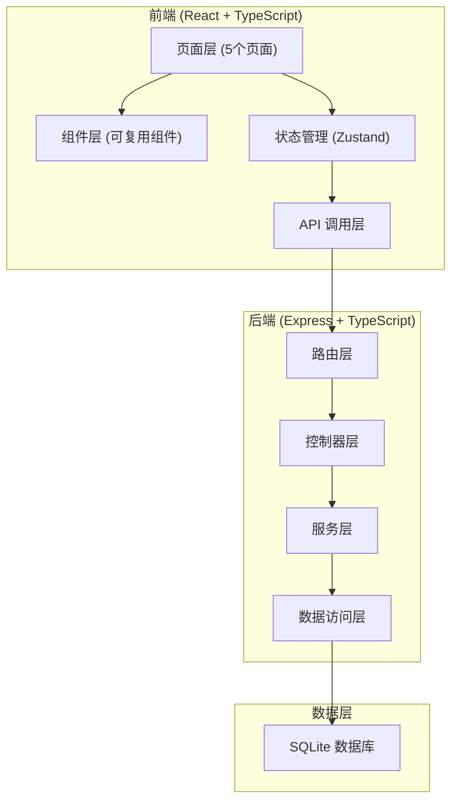
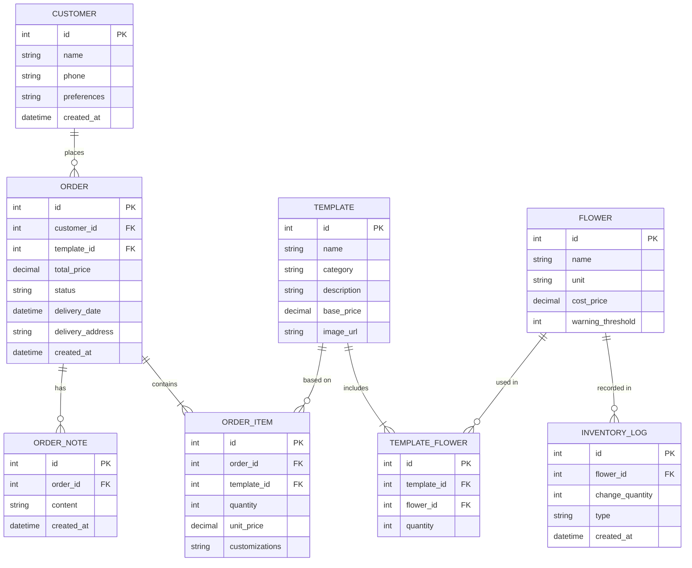

## 1. 架构设计

## 2. 技术描述
- **前端**：React 18 + TypeScript + Vite
- **样式**：TailwindCSS 3
- **状态管理**：Zustand
- **路由**：react-router-dom v6
- **图标**：lucide-react
- **图表**：recharts
- **后端**：Express 4 + TypeScript
- **数据库**：better-sqlite3（本地文件数据库，无需额外服务）
- **初始化工具**：vite-init

## 3. 路由定义

### 前端路由
| 路由路径 | 页面名称 | 说明 |
|---------|----------|------|
| / | 首页仪表盘 | 今日订单、库存预警、数据概览 |
| /templates | 花束模板 | 模板列表、模板详情 |
| /orders | 订单列表 | 所有订单、筛选搜索 |
| /orders/new | 新建订单 | 三步创建订单 |
| /orders/:id | 订单详情 | 订单信息、状态更新 |
| /inventory | 库存管理 | 花材库存、进货操作 |
| /customers | 客户管理 | 客户列表、客户详情 |
| /stats | 统计报表 | 销售统计、趋势分析 |

### 后端 API 路由
| 方法 | 路径 | 说明 |
|------|------|------|
| GET | /api/templates | 获取花束模板列表 |
| GET | /api/templates/:id | 获取模板详情及花材配方 |
| GET | /api/orders | 获取订单列表（支持筛选） |
| GET | /api/orders/today | 获取今日待配送订单 |
| GET | /api/orders/:id | 获取订单详情 |
| POST | /api/orders | 创建新订单 |
| PUT | /api/orders/:id/status | 更新订单状态 |
| POST | /api/orders/:id/notes | 添加订单备注 |
| GET | /api/inventory | 获取花材库存列表 |
| GET | /api/inventory/low-stock | 获取低库存花材 |
| PUT | /api/inventory/:id/restock | 花材进货 |
| GET | /api/customers | 获取客户列表 |
| GET | /api/customers/:id | 获取客户详情及历史订单 |
| POST | /api/customers | 新增客户 |
| PUT | /api/customers/:id | 更新客户信息 |
| GET | /api/stats/sales | 销售统计 |
| GET | /api/stats/top-templates | 畅销花束排名 |
| GET | /api/stats/orders-by-month | 月度订单趋势 |

## 4. 数据模型

### 4.1 ER 图

### 4.2 核心表说明

**花材表 (flowers)**
- 存储所有花材基础信息及成本价
- 包含预警阈值，低于该数量触发库存预警

**花束模板表 (templates)**
- 三大系列：玫瑰系列、百合系列、混搭系列
- 每个模板有基础售价，由花材成本加成计算

**模板花材关联表 (template_flowers)**
- 多对多关联模板和花材
- 记录每个花束所需各花材数量

**客户表 (customers)**
- 记录客户基本信息和喜好描述
- 手机号作为唯一标识

**订单表 (orders)**
- 订单状态：pending(待制作)、preparing(制作中)、delivering(配送中)、delivered(已送达)、cancelled(已取消)
- 记录配送日期时间和地址

**订单备注表 (order_notes)**
- 记录配送过程中的备注信息
- 如"客户说花很新鲜"、"门口保安代收"等

**库存变动表 (inventory_logs)**
- 记录每次库存变动（进货扣减）
- type: restock(进货) / order_deduction(订单扣减) / adjustment(调整)

## 5. 初始数据

系统预置以下初始数据：

### 花材（示例）
1. 红玫瑰 - 枝 - ¥3.5 - 预警30枝
2. 粉玫瑰 - 枝 - ¥3.8 - 预警30枝
3. 白百合 - 枝 - ¥8.0 - 预警20枝
4. 粉百合 - 枝 - ¥8.5 - 预警20枝
5. 满天星 - 扎 - ¥5.0 - 预警15扎
6. 尤加利叶 - 扎 - ¥6.0 - 预警10扎
7. 康乃馨 - 枝 - ¥2.5 - 预警40枝
8. 向日葵 - 枝 - ¥5.0 - 预警25枝

### 花束模板（示例）
**玫瑰系列：**
1. 经典红玫瑰束 - 11枝红玫瑰 + 满天星 + 尤加利 - ¥128
2. 粉色梦幻 - 11枝粉玫瑰 + 满天星 - ¥138
3. 99朵玫瑰 - 99枝红玫瑰 + 配叶 - ¥888

**百合系列：**
1. 白色香水百合 - 6枝白百合 + 配草 - ¥158
2. 百合混搭 - 3白3粉百合 + 配叶 - ¥168

**混搭系列：**
1. 向日葵混搭 - 5向日葵 + 玫瑰 + 配草 - ¥98
2. 康乃馨温馨 - 19枝康乃馨 + 百合 - ¥118
3. 缤纷花束 - 多种花材混搭 - ¥198

### 示例客户
1. 张小姐 - 13800138001 - 喜欢粉色系，爱加满天星
2. 李先生 - 13900139002 - 每次加一盒巧克力
3. 王女士 - 13700137003 - 偏爱百合花
